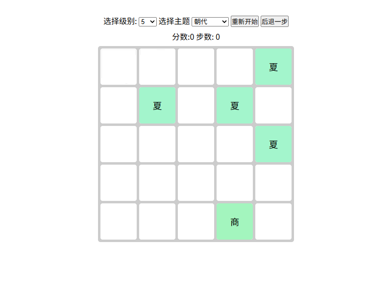
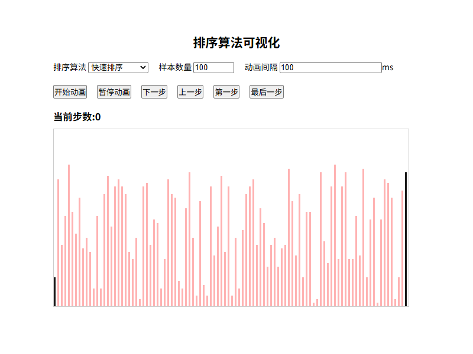
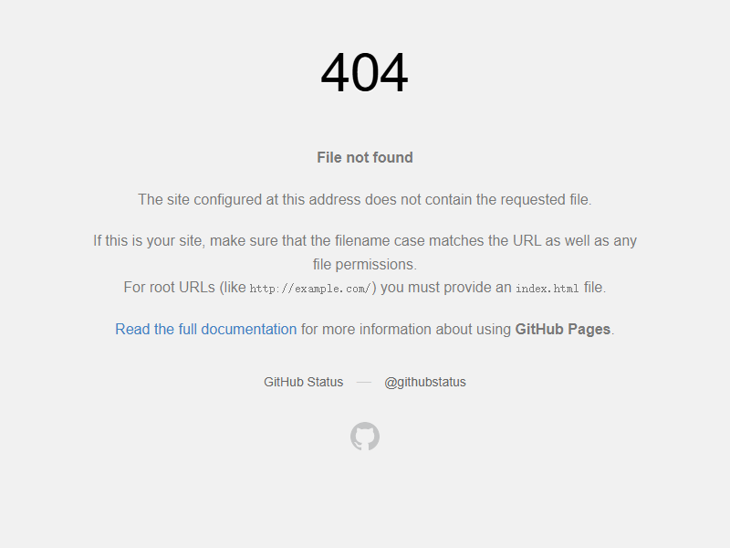
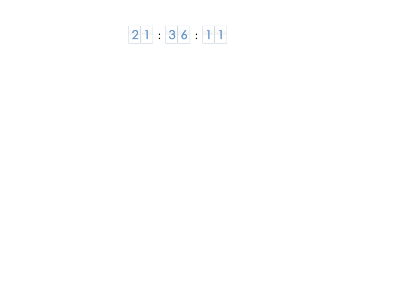
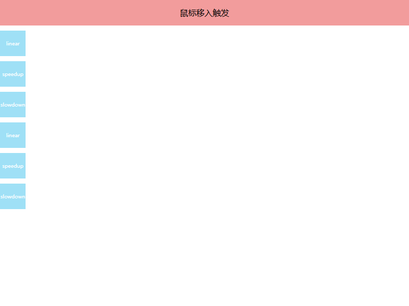

# 小桑前端作品集 (Xiaosang Frontend Portfolio)

<p align="center">
  
</p>

<p align="center">
  <strong>一个前端开发者的学习与实践作品集</strong>
</p>

<p align="center">
  <a href="https://holynova.github.io">🌐 在线预览</a> •
  <a href="https://github.com/holynova/holynova.github.io">📦 GitHub</a> •
  <a href="mailto:holy_nova@126.com">📧 联系我</a>
</p>

---

## 📖 项目简介

这是一个前端开发者的学习与实践作品集，包含了 **50+ 个前端项目和演示**，涵盖了原生 JavaScript、CSS3 动画、主流前端框架（React、Vue、Angular）等多个技术领域。每个项目都是一个独立的学习案例，展示了不同的前端技术和实现思路。

## 🚀 在线预览

**👉 [https://holynova.github.io](https://holynova.github.io)**

## 📸 项目截图

> 💡 **提示**: 以下截图展示了部分代表性项目的界面效果

<div align="center">
  <table>
    <tr>
      <td align="center">
        <br>
        <b>2048 游戏</b>
      </td>
      <td align="center">
        <br>
        <b>排序算法可视化</b>
      </td>
      <td align="center">
        <br>
        <b>日历组件</b>
      </td>
    </tr>
    <tr>
      <td align="center">
        <br>
        <b>动态时钟</b>
      </td>
      <td align="center">
        <br>
        <b>动画效果</b>
      </td>
      <td align="center">
        <br>
        <b>页面布局</b>
      </td>
    </tr>
  </table>
</div>

## 🎯 项目分类

### 1. 🎮 JS 综合作品

| 项目 | 描述 | 链接 |
|------|------|------|
| 2048 游戏 | 个性化定制 2048 游戏 | [在线演示](https://holynova.github.io/pages/2048new/index.html) |
| 排序算法可视化 | 多种排序算法的可视化展示 | [在线演示](https://holynova.github.io/algorithm/show_sort/index.html) |
| 二手房计算器 | 房贷计算工具 | [在线演示](https://holynova.github.io/pages/buy_house/index.html) |
| 人名转拼音工具 | 中文姓名转拼音 | [在线演示](https://holynova.github.io/pages/pinyin_converter) |
| 日期选择器 | 自定义日期选择器插件 | [在线演示](https://holynova.github.io/plug_in/date_picker/demo.html) |
| 滑动解锁插件 | iOS 风格滑动解锁 | [在线演示](https://holynova.github.io/plug_in/slide_to_unlock/index.html) |
| 面向对象选项卡 | OOP 实现的选项卡组件 | [在线演示](https://holynova.github.io/pages/tabs4.0/tabs4.0.html) |
| 词频统计 | 文本词频分析工具 | [在线演示](https://holynova.github.io/pages/my_page/frequency.html) |
| 电缆型号翻译 | 电缆型号查询工具 | [在线演示](https://holynova.github.io/pages/cable_name/cable_name.html) |

### 2. ⚛️ 主流前端框架

| 项目 | 框架 | 链接 |
|------|------|------|
| 购物清单 | React | [在线演示](https://holynova.github.io/framework/react/index.html) |
| 井字棋 | React | [在线演示](https://holynova.github.io/framework/react_tictactoe/index.html) |
| 留言板 | AngularJS | [在线演示](https://holynova.github.io/framework/learn_angular/ng_comments/index.html) |
| 知乎注册页 | AngularJS | [在线演示](https://holynova.github.io/framework/learn_angular/ng_signup/index.html) |
| 还款利息计算器 | Vue | [在线演示](https://holynova.github.io/framework/vue_return_money2/index.html) |
| 还款利息计算器 | Angular | [在线演示](https://holynova.github.io/framework/angular_return_money/index.html) |
| 还款利息计算器 | H5/CSS3 | [在线演示](https://holynova.github.io/css3/return_money/index.html) |
| 微博应用 | Node.js | [在线演示](https://holynova.github.io/framework/learn_node/server/index.html) |

### 3. 📐 页面布局

| 项目 | 描述 | 链接 |
|------|------|------|
| 京东布局 | 京东商城首页复刻 | [在线演示](https://holynova.github.io/layout/jingdong/index.html) |
| 腾讯布局 | 腾讯首页复刻 | [在线演示](https://holynova.github.io/pages/qq.com/index.html) |
| 家具网站 v1.0 | 家具电商布局 | [在线演示](https://holynova.github.io/pages/furnitureV1.0/index.html) |
| 家具网站 v2.0 | Bootstrap 响应式布局 | [在线演示](https://holynova.github.io/pages/furnitureV2.0/full_screen.html) |
| jQuery Mobile | 移动端布局 | [在线演示](https://holynova.github.io/pages/mobile/index.html) |

### 4. 🌐 Web 技术

| 项目 | 技术点 | 链接 |
|------|--------|------|
| Cookie 演示 | Cookie 操作 | [在线演示](https://holynova.github.io/tech/cookie/index.html) |
| Ajax 演示 | Ajax 请求 | [在线演示](https://holynova.github.io/tech/ajax/index.html) |
| 自定义事件 | JS 自定义事件 | [在线演示](https://holynova.github.io/tech/custom_event/index.html) |
| JSONP 搜索建议 | JSONP 跨域 | [在线演示](https://holynova.github.io/tech/jsonp/index.html) |
| Web 性能优化 | 性能优化技巧 | [在线演示](https://holynova.github.io/tech/optimize_web/index.html) |

### 5. ✨ 页面效果和小功能

| 项目 | 描述 | 链接 |
|------|------|------|
| 购物车 | 购物车功能实现 | [在线演示](https://holynova.github.io/pages/shopping_cart/shopping_cart.html) |
| 标签选项卡 | 选项卡组件 | [在线演示](https://holynova.github.io/pages/tabs2.0/tabs2.0.html) |
| 多级导航菜单 | 多级下拉菜单 | [在线演示](https://holynova.github.io/pages/nav_menu/nav_menu.html) |
| 表单验证 | 原生 JS 表单验证 | [在线演示](https://holynova.github.io/pages/table_verify/index.html) |
| 富文本编辑器 | 富文本编辑功能 | [在线演示](https://holynova.github.io/pages/rich_edit/rich_edit.html) |
| 放大镜 | 任意比例放大镜 | [在线演示](https://holynova.github.io/pages/magnify_glassV2/magnify.html) |
| CSS Sprite | CSS 精灵图演示 | [在线演示](https://holynova.github.io/pages/css_sprite/css_sprite.html) |
| 倒计时 | 倒计时功能 | [在线演示](https://holynova.github.io/pages/count_down/index.html) |
| 变色时钟 | 动态变色时钟 | [在线演示](https://holynova.github.io/pages/clock/index.html) |
| 图片轮播 | 图片轮播组件 | [在线演示](https://holynova.github.io/pages/slide/slide.html) |
| 瀑布流 | 瀑布流布局 | [在线演示](https://holynova.github.io/pages/waterfall/waterfall.html) |
| 360° 旋转 | 360 度旋转展示 | [在线演示](https://holynova.github.io/pages/360spin/index.html) |
| 豆瓣打分 | 星级评分组件 | [在线演示](https://holynova.github.io/pages/star_grade/index.html) |
| 手风琴菜单 | 手风琴折叠效果 | [在线演示](https://holynova.github.io/pages/top10_tab/index.html) |
| 图标拖拽 | 拖拽功能实现 | [在线演示](https://holynova.github.io/pages/drag/drag.html) |
| 自定义滚动条 | 自定义滚动条样式 | [在线演示](https://holynova.github.io/pages/custom_scroll_bar/custom_scroll_bar.html) |

### 6. 🎬 动画效果

| 项目 | 描述 | 链接 |
|------|------|------|
| 动画框架 | 自定义动画框架 | [在线演示](https://holynova.github.io/pages/animation_framework2/animation.html) |
| 动态时钟 | Canvas 动态时钟 | [在线演示](https://holynova.github.io/pages/clock_animation/clock.html) |
| 幻灯片切换 | 左右/上下/淡入淡出/无缝滚动 | [在线演示](https://holynova.github.io/pages/slide_with_animations/slide.html) |
| 手风琴菜单 | 动画手风琴效果 | [在线演示](https://holynova.github.io/animations/menu/index.html) |
| 打字效果 | 打字机动画 | [在线演示](https://holynova.github.io/animations/typing/index.html) |
| 图片翻页 | 图片翻页特效 | [在线演示](https://holynova.github.io/animations/next_pic/index.html) |
| Mac Dock 效果 | macOS Dock 栏动画 | [在线演示](https://holynova.github.io/animations/macdock/index.html) |
| 图标对齐 | 图标对齐排列动画 | [在线演示](https://holynova.github.io/animations/icon_align/index.html) |
| 进度条幻灯片 | 带进度条的轮播 | [在线演示](https://holynova.github.io/animations/slide_with_progress/index.html) |
| 唱片封面浏览 | 专辑封面展示 | [在线演示](https://holynova.github.io/animations/album/index.html) |
| 圆形运动 | 圆形轨迹运动 | [在线演示](https://holynova.github.io/animations/circle/index.html) |
| 浮动遮罩 | 浮动遮罩信息展示 | [在线演示](https://holynova.github.io/animations/float_mask/index.html) |
| 触摸事件 | 触摸事件模拟 | [在线演示](https://holynova.github.io/animations/touch_demo/index.html) |

### 7. 🎨 CSS3 效果

| 项目 | 描述 | 链接 |
|------|------|------|
| 重力倾斜 | 重力感应倾斜效果 | [在线演示](https://holynova.github.io/css3/rotate/index.html) |
| 水平垂直居中 | 多种居中方案 | [在线演示](https://holynova.github.io/css3/center/index.html) |
| Flex 布局 | Flex 弹性布局演示 | [在线演示](https://holynova.github.io/css3/flex/index.html) |

## 🛠️ 技术栈

- **前端基础**: HTML5, CSS3, JavaScript (ES5/ES6)
- **前端框架**: React, Vue.js, Angular, AngularJS
- **后端技术**: Node.js
- **CSS 框架**: Bootstrap
- **移动端**: jQuery Mobile
- **构建工具**: 原生开发，无构建工具依赖

## 📁 项目结构

```
holynova.github.io/
├── index.html          # 主页入口
├── algorithm/          # 算法演示
├── animations/         # 动画效果
├── css3/              # CSS3 效果
├── framework/         # 前端框架示例
├── layout/            # 页面布局
├── pages/             # 各类页面项目
├── plug_in/           # 插件
├── script/            # 公共脚本
├── tech/              # Web 技术演示
└── screenshots/       # 项目截图
```

## 🚀 本地运行

```bash
# 克隆项目
git clone https://github.com/holynova/holynova.github.io.git

# 进入项目目录
cd holynova.github.io

# 使用任意静态服务器启动，例如：
# 方法 1: 使用 Python
python -m http.server 8080

# 方法 2: 使用 Node.js (需要先安装 http-server)
npx http-server -p 8080

# 方法 3: 使用 VS Code 的 Live Server 插件

# 访问 http://localhost:8080
```

## 📝 如何添加截图

如果你想为项目添加截图，请按照以下步骤：

1. 准备 200px 宽度的截图（建议使用 PNG 格式）
2. 将截图放入 `screenshots/` 目录
3. 命名规则：`项目名称.png`（如 `2048.png`、`sort.png`）
4. 截图会自动显示在 README 中

## 🤝 贡献

欢迎提交 Issue 和 Pull Request！

1. Fork 本项目
2. 创建你的特性分支 (`git checkout -b feature/AmazingFeature`)
3. 提交你的更改 (`git commit -m 'Add some AmazingFeature'`)
4. 推送到分支 (`git push origin feature/AmazingFeature`)
5. 打开一个 Pull Request

## 📄 许可证

本项目采用 MIT 许可证 - 查看 [LICENSE](LICENSE) 文件了解详情

## 📧 联系方式

- **邮箱**: [holy_nova@126.com](mailto:holy_nova@126.com)
- **GitHub**: [holynova](https://github.com/holynova)

---

<p align="center">
  <sub>用 ❤️ 和 JavaScript 构建</sub>
</p>
